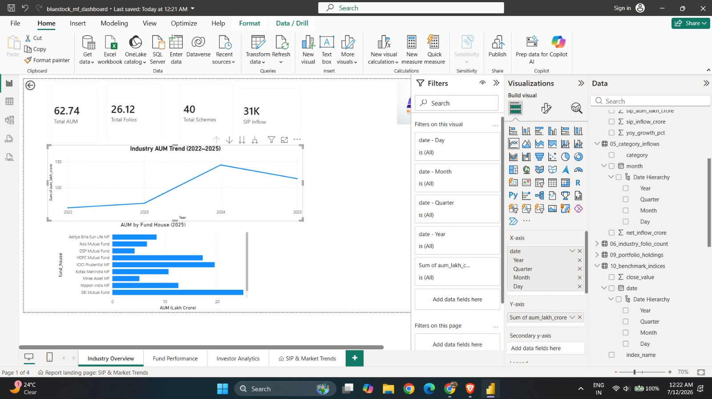
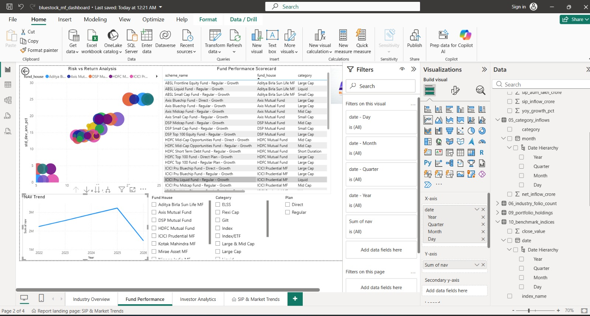
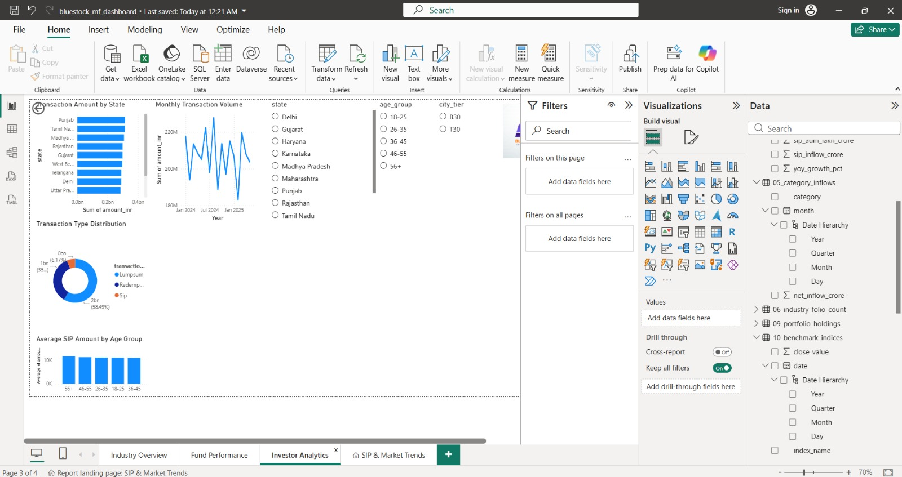
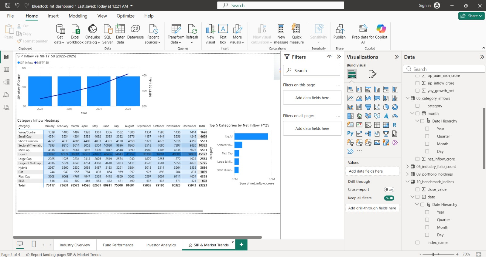

# 📊 Bluestock Mutual Fund Capstone

> **Internship Project:** Developed during my **Data Analytics Internship at Bluestock Fintech** as part of the **Mutual Fund Analytics Capstone Project**. This project demonstrates an end-to-end data analytics workflow using Python, SQL, SQLite, and Power BI to analyze the Indian Mutual Fund industry.

---

# 📌 Project Overview

The Bluestock Mutual Fund Capstone is a comprehensive data analytics project designed to analyze the performance of Indian mutual funds and investor behavior using real-world financial datasets.

The project covers the complete analytics lifecycle including:

- Data Ingestion
- Data Cleaning & Validation
- Database Design
- Exploratory Data Analysis (EDA)
- Performance Analytics
- Interactive Dashboard Development
- Advanced Risk Analytics
- Business Insights & Reporting

The objective is to transform raw financial data into meaningful insights for investors and demonstrate practical skills in Data Analytics, Business Intelligence, and Financial Analysis.

---

# 🎯 Objectives

- Build an automated ETL pipeline.
- Clean and validate mutual fund datasets.
- Store processed data in SQLite.
- Perform Exploratory Data Analysis (EDA).
- Calculate mutual fund performance metrics.
- Build an interactive Power BI Dashboard.
- Perform advanced financial risk analysis.
- Generate actionable investment insights.

---

# 🛠 Technology Stack

- Python
- Pandas
- NumPy
- Matplotlib
- Plotly
- SQLite
- SQL
- Power BI
- Jupyter Notebook
- Git & GitHub

---

# 📂 Project Structure

```text
Bluestock-Mutual-Fund/

├── dashboard/
│   ├── bluestock_mf_dashboard.pbix
│   └── bluestock_mf_dashboard.pdf
│
├── data/
│   ├── raw/
│   ├── processed/
│   └── db/
│
├── notebooks/
│   ├── EDA_Analysis.ipynb
│   ├── Performance_Analytics.ipynb
│   └── Advanced_Analytics.ipynb
│
├── reports/
│   ├── charts/
│   ├── var_cvar_report.csv
│   ├── rolling_sharpe_chart.png
│   ├── benchmark_comparison.png
│   ├── alpha_beta.csv
│   ├── cagr_comparison.csv
│   └── fund_scorecard.csv
│
├── scripts/
│   ├── data_ingestion.py
│   ├── live_nav_fetch.py
│   ├── validate_amfi.py
│   ├── clean_nav.py
│   ├── clean_transactions.py
│   ├── clean_performance.py
│   ├── load_sqlite.py
│   ├── etl_pipeline.py
│   └── recommender.py
│
├── sql/
│   ├── schema.sql
│   └── queries.sql
│
├── README.md
└── requirements.txt
```

---

# 📊 Dataset

The project uses multiple datasets covering different aspects of the Indian Mutual Fund industry.

- Fund Master
- NAV History
- Industry AUM
- SIP Inflows
- Category Inflows
- Folio Count
- Scheme Performance
- Investor Transactions
- Portfolio Holdings
- Benchmark Indices

---

# ⚙ ETL Pipeline

The ETL pipeline automates the complete preprocessing workflow.

### Features

- Data ingestion
- Data cleaning
- Missing value handling
- Data validation
- SQLite loading
- Error handling

Run the pipeline using:

```bash
python scripts/etl_pipeline.py
```

---

# 📈 Exploratory Data Analysis

The EDA notebook includes:

- NAV Trend Analysis
- AUM Growth Analysis
- SIP Growth Analysis
- Investor Demographics
- Correlation Analysis
- Portfolio Allocation Analysis

---

# 📉 Performance Analytics

Implemented financial performance metrics including:

- Daily Returns
- CAGR
- Alpha
- Beta
- Sharpe Ratio
- Sortino Ratio
- Maximum Drawdown
- Benchmark Comparison

---

# 📊 Interactive Power BI Dashboard

The dashboard contains four interactive pages.

### 1️⃣ Industry Overview

- KPI Cards
- Industry AUM Trend
- AUM by Fund House

### 2️⃣ Fund Performance

- Return vs Risk Scatter Plot
- Fund Scorecard
- NAV Trend
- Fund Filters

### 3️⃣ Investor Analytics

- Transactions by State
- SIP Distribution
- Age Group Analysis
- Monthly Transaction Trend

### 4️⃣ SIP & Market Trends

- SIP vs NIFTY Trend
- Category Inflow Heatmap
- Top Categories by Net Inflow

Dashboard features include:

- Interactive slicers
- Drill-through navigation
- Dynamic filtering
- Cross highlighting

---

# 📈 Advanced Analytics

Advanced analytics performed include:

- Historical VaR (95%)
- Conditional VaR (CVaR)
- Rolling 90-Day Sharpe Ratio
- Investor Cohort Analysis
- SIP Continuity Analysis
- Rule-based Mutual Fund Recommendation System
- Portfolio Concentration Analysis (HHI)

---

# 📊 Key Results

- Processed over **46,000 NAV records**.
- Analyzed **32,000+ investor transactions**.
- Built a **4-page interactive Power BI Dashboard**.
- Calculated portfolio risk metrics for **40 mutual fund schemes**.
- Developed a rule-based recommendation engine using **Risk Grade** and **Sharpe Ratio**.
- Generated business insights to support investment decision-making.

---

# 🚀 Installation

Clone the repository

```bash
git clone https://github.com/YashG21/Bluestock-Mutual-Fund.git
```

Move to the project folder

```bash
cd Bluestock-Mutual-Fund
```

Install dependencies

```bash
pip install -r requirements.txt
```

Run ETL Pipeline

```bash
python scripts/etl_pipeline.py
```

---

# 📸 Dashboard Preview







---

# 🎓 Internship Information

This project was completed as part of my **Data Analytics Internship at Bluestock Fintech** under the **Mutual Fund Analytics Capstone Program**.

The project demonstrates practical implementation of:

- Data Engineering
- Data Cleaning
- SQL Database Design
- Exploratory Data Analysis
- Financial Performance Analytics
- Business Intelligence using Power BI
- Risk Analytics
- Python Automation

The repository is maintained for internship evaluation, learning, and portfolio purposes.

---

# 👨‍💻 Author

**Yash Gawade**

B.Tech – Computer Science & Engineering

VIT-AP University

GitHub: https://github.com/YashG21/Bluestock-Mutual-Fund

LinkedIn: https://www.linkedin.com/in/yash-gawade-a8bb8b244/

---

# ⭐ Acknowledgement

I would like to thank **Bluestock Fintech** for providing the opportunity to work on this capstone project during my Data Analytics Internship. This project helped strengthen my practical knowledge of data engineering, financial analytics, SQL, Python, and Power BI through hands-on industry-oriented tasks.